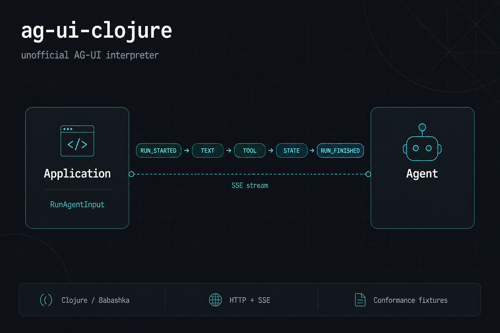

# ag-ui-clojure

[](https://github.com/jattenberg/ag-ui-clojure/actions/workflows/ci.yml)
[](LICENSE)
[](https://clojure.org)
[](https://babashka.org)
[](https://docs.ag-ui.com)
[](https://mochi-protocol-zoo.onrender.com/)

Independent [AG-UI](https://docs.ag-ui.com/) (Agent–User Interaction Protocol) implementation in Clojure.

**This is not an official AG-UI SDK.** It exists to test whether the published protocol is precise enough to implement from the specification, and to produce fixtures and checks other implementations can reuse.



AG-UI is an event protocol: an application sends one `RunAgentInput` and receives an ordered stream of typed JSON events (usually over HTTP + Server-Sent Events).

**Live demo:** [Mochi Protocol Zoo](https://mochi-protocol-zoo.onrender.com/) — one Render web service, classpath HTML, deterministic echo agent, no LLM.

## Why independent

- Behaviour is derived from the [draft specification](https://docs.ag-ui.com/spec/draft/) and pinned [`spec/draft/schema.json`](spec/draft/schema.json), not from a port of the TypeScript SDK.
- Core protocol code has no dependency on CopilotKit, LangGraph, OpenAI, or any model vendor.
- Ambiguities are recorded in [`docs/spec-ambiguities.md`](docs/spec-ambiguities.md) instead of being papered over.

## Installation

Requires Clojure CLI (1.12+) and a JDK for the full suite. [Babashka](https://babashka.org/) is optional for the same protocol code without a JVM: conformance CLI, unit tests, client, and a short-lived echo server.

```bash
git clone https://github.com/jattenberg/ag-ui-clojure.git
cd ag-ui-clojure
clojure -P -M:test
# optional
bb test
bb conformance
```

## Mochi Protocol Zoo

A round-hamster UI on the echo server. Tap a protocol family; the page `POST`s `RunAgentInput` to `/agent` and lists the SSE events.

| Pill | What the echo stream shows |
| --- | --- |
| `tool` | `TOOL_CALL_*` plus a result |
| `state` | `STATE_SNAPSHOT` and a JSON Patch `STATE_DELTA` |
| `interrupt` | `RUN_FINISHED` with `outcome.type=interrupt`; **Proceed?** sends `resume` |
| `error` | `RUN_ERROR` |
| `activity` | `ACTIVITY_SNAPSHOT` / `ACTIVITY_DELTA` |
| `subagent` | nested `SUBAGENT_STARTED` / `SUBAGENT_FINISHED` |

Other echo keywords (curl / client only): `custom`, `reasoning`, `encrypted`, `snapshot`, `chunk`. Empty or unmatched text is `Hello, world.` as `TEXT_MESSAGE_*`.

| Method | Path | Response |
| --- | --- | --- |
| `GET` | `/` or `/index.html` | HTML from [`resources/public/index.html`](resources/public/index.html) |
| `POST` | `/` or `/agent` | SSE (`Accept: text/event-stream` required) |
| `GET` | `/health` | `ok` |

Open the zoo from the same origin as the agent. Cursor HTML preview and `file://` make `fetch("/agent")` miss the server.

## Echo server

JVM is the long-running host (local and Render). Babashka `bb server` is a probe, not the production process.

```bash
clojure -M:server 8000
# probe:
bb server 8000
```

Then [http://127.0.0.1:8000/](http://127.0.0.1:8000/). `PORT` may come from the environment instead of the CLI arg.

```bash
curl -N -X POST http://127.0.0.1:8000/agent \
  -H "Content-Type: application/json" \
  -H "Accept: text/event-stream" \
  -d '{"threadId":"t","runId":"r","messages":[{"id":"u1","role":"user","content":"tool"}]}'
```

The echo agent is a pure function of `RunAgentInput` ([`ag-ui.server.echo`](src/ag_ui/server/echo.clj)). No model, no outbound APIs, no database.

## Render

The public demo is a single Docker web service:

- URL: https://mochi-protocol-zoo.onrender.com/
- Blueprint: [`render.yaml`](render.yaml) (Starter, Oregon, health check `/health`)
- Image: [`Dockerfile`](Dockerfile) (`clojure -M:server`, `PORT` from Render)

Push to `main` and Render rebuilds. First request after idle can be a cold start. There is no Postgres, Redis, or LLM bill; compute is the cost.

To recreate: [New Blueprint](https://dashboard.render.com/select-repo?type=blueprint) on this GitHub repo and apply `render.yaml`.

## Minimal client

```clojure
(require '[ag-ui.client.http :as client])

(client/run-agent
  {:url "http://127.0.0.1:8000/agent"
   :input {:thread-id "t"
           :run-id "r"
           :messages [{:id "u1" :role "user" :content "Hello"}]}})
```

Against the live host, use `https://mochi-protocol-zoo.onrender.com/agent`.

CLI:

```bash
clojure -M:client http://127.0.0.1:8000/ Hello
bb client http://127.0.0.1:8000/ Hello
```

Events are plain maps:

```clojure
{:type "RUN_STARTED" :thread-id "t" :run-id "r"}
```

```clojure
(require '[ag-ui.events :as events])
(events/validate-event event)
```

## Conformance and tests

```bash
clojure -M:conformance --profile all
clojure -M:test
bb test
bash script/ci.sh
```

See [`docs/testing.md`](docs/testing.md), [`docs/conformance.md`](docs/conformance.md), [`fixtures/manifest.json`](fixtures/manifest.json), and [`docs/`](docs/README.md).

## Interoperability

See [`docs/interoperability.md`](docs/interoperability.md). Goal: Clojure client consumes an external AG-UI server; an external client consumes the Clojure server.

## Architecture

See [`docs/architecture.md`](docs/architecture.md). Protocol, JSON, SSE, and HTTP are separate namespaces. The reducer is a pure function of `(state, event)`.

## Known limitations

- HTTP+SSE only (no protobuf binding).
- Dual runtime: JVM Clojure is the full implementation (property tests, JSON Schema, preferred long-running server). Babashka runs the same protocol namespaces for conformance, unit tests, client, and a probe server.
- The HTTP handler writes the full SSE body at once (legal, not chunked-over-time). The zoo staggers list items in the browser.
- Live CopilotKit Dojo tests are manual.

## Spec ambiguities

[`docs/spec-ambiguities.md`](docs/spec-ambiguities.md)

## Relationship to upstream

Upstream: [ag-ui-protocol/ag-ui](https://github.com/ag-ui-protocol/ag-ui). First-party SDKs are TypeScript, Python, and .NET. This repository is a personal, unofficial interpreter and conformance sketch. It does not speak for the AG-UI authors. Fixture-pack offer: [`docs/upstream.md`](docs/upstream.md).

## License

MIT
